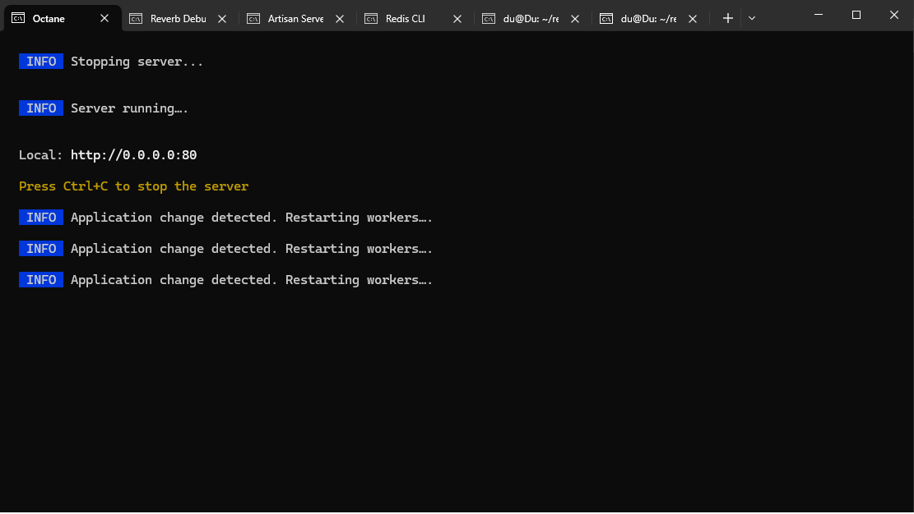
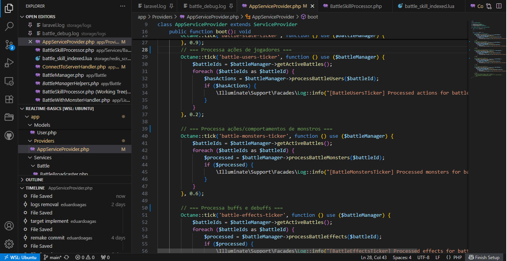
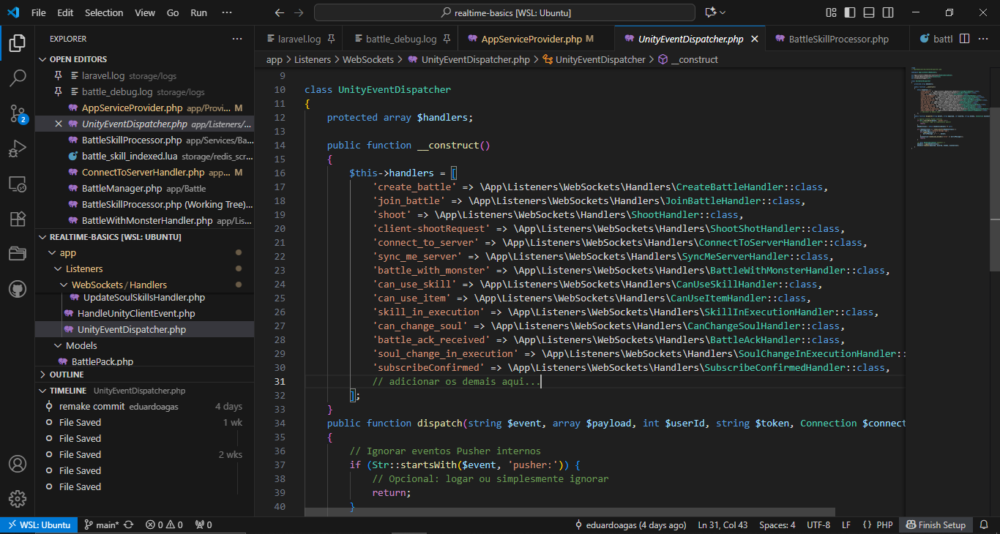
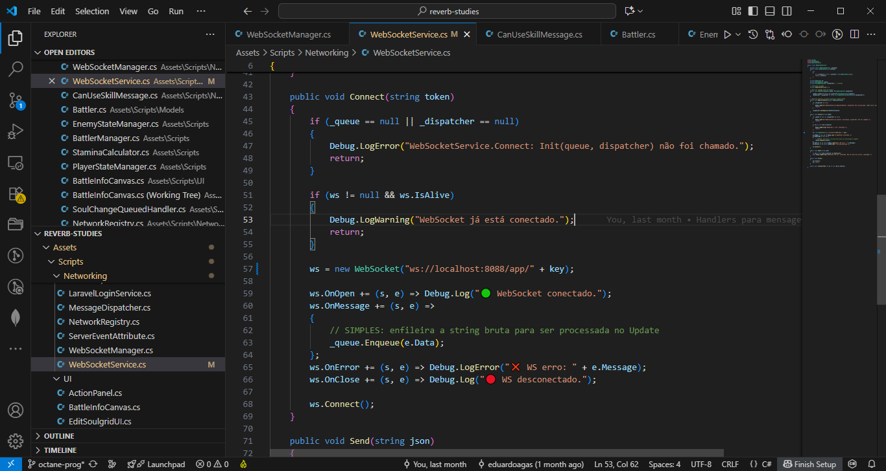

# Laravel Octane Server

## Tecnologias

###### requisitos
Laravel - Octane + Swoole, Reverb
Docker

###### opcionais
Laravel - Sail, Breeze
Redis
PostgreSQL

## Sobre

Este repositório se trata do código do servidor (até certo ponto) do meu projeto de Online Game Backend. A ideia desse repositório público é demonstrar como utilizei **Laravel** como backend para jogos online. A parte do código específica às lógicas do game podem ser encontradas também, mostrando diretamente como uso certas ferramentas no *server-authorative logic*, como por exemplo, **Redis** para auxiliar o servidor, mas o backend pode ser construído seguindo apenas a estrutura demonstrada aqui no READ ME.

## Estrutura

Este servidor se comunica com o front-end por duas formas. Por meio de **websockets** (trocando mensagens rápidas entre ele e Unity) e por meio de **requests http** (lidando com o Breeze, exclusivamente para facilitar usuários se cadastrarem e editar seus dados pelo browser). O uso de Unity não é obrigatório, já que este sistema está completamente desacoplado do frontend de websockets, mas darei um exemplo rápido do cliente na demonstração.

## Por que Laravel Octane Swoole?

Como um programador Laravel, sempre quis poder unir a organização e praticidade que Laravel já disponibiliza para projetos http com a dinâmica de conexão rápidas e contínua exigida pelos *multiplayer online games*. Este projeto foi também uma pesquisa e desbravamento dos potenciais do framework. Inicialmente, antes de personalizar o framework com Octabe, adaptei **Laravel Reverb** a este sistema, que já vem com uma promessa de troca rápida de mensagens. Notei que o Reverb sozinho estava mais destinado a soluções menos complexas e que, rodando oenvio de mensagem sempre na main-thread junto com o resto do servidor não atenderia as necessidades de velocidade que eu tinha mente. Aí que entrou Octane+Swoole, com seus múltiplos *workers*. O servidor Octane agora se encarregaria de enviar as mensagens automaticamente com seus cores programados para isso em processos paralelos e *voi-la*, Laravel Reverb estava enviando múltiplas mensagens para diversos clientes na velocidade da luz, sem interromper nenhum processo da main-thread do servidor.  


## Demonstração

###### Obs: Estarei usando um alias sail para ./vendor/bin/sail no terminal. Caso não queira utilizar Sail, você pode substituir onde for sail para "php". Caso não queira utilizar o alias, use ./vendor/bin/sail de vez "sail".

### Octane+Swoole

Rodar o seguinte comando no terminal do sail iniciará o server Swoole do Octane na porta 80 (que pode/deve ser configurada no *Dockerfile*). O comando --watch permite ao octane automaticamente se atualizar caso o código mude.

```
sail artisan octane:start --server=swoole --host=0.0.0.0 --port=80 --watch
```

<p align="center"></p>

Isso vai iniciar a classe Octane no Provider (e também seus listeners em qualquer outra parte do código). O Octane agora está responsável por disparar processos com o método tick que repete o método dentro dele a cada intervalo de tempo, em segundos, pré-estabelecido (0.2, 0.6, 1.0).

<p align="center"></p>

### Reverb

Rodar o seguinte comando no terminal do sail iniciará o server Reverb na host:porta escolhida (que pode/deve ser configurada no *Dockerfile*). O comando --debug permite acompanhar as mensagens enviadas e recebidas pelo terminal.

```
sail artisan reverb:start --debug
```

Aqui o servidor Reverb recebeu uma mensagem do cliente requisitando conexão ("Message Received" + pacote com o json recebido) e confirmou que o Laravel lidou com a mensagem sem erros ("Message Handled", vide connectToServerHandler.php que está especificamente programado para lidar com mensagens que contenham o nome do event = "connect_to_server").

<p align="center"></p>

O servidor configura um dispatcher para diversos events, organizando um handler para cada tipo de mensagem.

<p align="center"></p>

### Cliente

Um exemplo de como o cliente está programado para receber mensagens do servidor. (Unity Engine + WebSocketSharp library).


<p align="center"></p>


